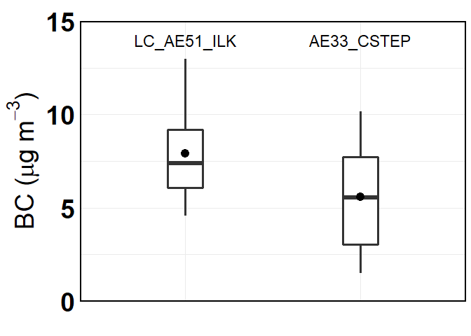
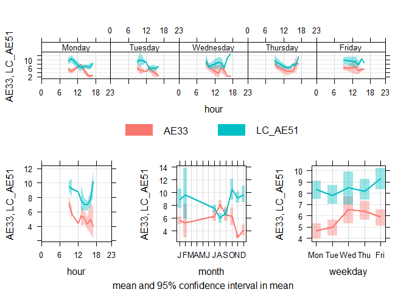
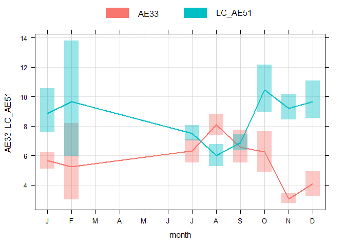

BC Ambient
================
Adithi
5/29/2020

<style type="text/css">

body, td {
   font-size: 16px;
}
code.r{
  font-size: 16px;
}
pre {
  font-size: 16px
}
</style>

## Black Carbon (BC) Ambient Measurements at CSTEP and ILK Labs

The instruments used:

  - at ILK Labs : Loading Corrected AE51 (30 mins before and after the
    ride)

  - at CSTEP : AE33 (24 hours)

## Days of measurement- Start Date

  - AE51: 14 May 2019

*Average of ambient hour*

``` r
names(data_final_BC1)<-c("date", "LC_AE51_ILK")
calendarPlot(data_final_BC1, pollutant = "LC_AE51_ILK")
```

<!-- -->

  - AE33: 11 July 2019

*24 hour average*

``` r
names(Final1)<-c("date", "AE33_CSTEP")
calendarPlot(Final1, pollutant = "AE33_CSTEP")
```

<!-- -->

## Correlation plot

From here on, the data for both AE33 and AE51 were filtered where both
the data were present ie: starting from July 11 2019 to 19 February
2020. The hours of AE51 were matched with corresponding hours of AE33.

  - LC\_AE51\_ILK: Loading corrected AE51 measurements of BC

  - AE33\_CSTEP: AE33 measurements of BC

<!-- end list -->

``` r
t<- Correlation(BC$AE33_CSTEP, BC$LC_AE51_ILK, BC, lm, 5, 25, 30, "LC_AE51_ILK", "AE33_CSTEP")
t
```

<!-- -->

## Time series

``` r
theme_set(theme_light(base_size = 15, base_family = "Poppins"))
names(BC)<-c("date", "LC_AE51_ILK",  "AE33_CSTEP")
BC$date<- as.POSIXct(BC$date, format='%Y-%m-%d %H:%M:%S', tz="Asia/Kolkata")
BC_melt<-reshape2::melt(BC, id="date", measure.vars = c( "LC_AE51_ILK",  "AE33_CSTEP") )
names(BC_melt)<-c("date","Instrument", "BC")
p1<-ggplot(BC_melt, aes(date, BC, color=Instrument))+geom_line(size=1.2)+
  labs(x="",  y= expression(paste(BC," (", mu, "g",~m^{-3}, ")")))+ scale_y_continuous(limits = c(0,30), expand = c(0, 0))+scale_x_datetime(date_breaks = "1 month", date_labels = "%b %y")+scale_color_uchicago()+
  theme(axis.title = element_text(size = 16, face = "bold"),
        axis.text.x = element_text(family = "Roboto Mono", size = 14, angle = 90), panel.border = element_rect(colour = "black", fill="NA", size=1.2))
p1
```

<!-- -->

## t-test

The t-test resulted in p value = 0, mean of LC\_AE51\_ILK = 8.32, and
mean of AE33\_CSTEP = 5.72.

## Box Plot

``` r
BC_melt<-reshape2::melt(BC, id="date", measure.vars = c( "LC_AE51_ILK",  "AE33_CSTEP") )
names(BC_melt)<-c("date","Instrument", "BC")
p1<-ggplot(BC_melt, aes(Instrument, BC))+ 
  labs(x="", y= expression(paste("BC" ," (", mu, "g",~m^{-3}, ")")),title=paste0(""))+
  stat_summary(fun.data = f, geom="boxplot", width=0.2, size=1.2)+  
  stat_summary(fun.y=mean, colour="black", geom="point",size=4)+
  scale_y_continuous(limits = c(0,15), expand = c(0, 0))+theme_minimal()+
  theme(legend.text=element_text(size=14),plot.subtitle = element_text(size = 10, face = "bold"),
        plot.title = element_text(size = 12, face = "bold"), 
        axis.title = element_text(size=28, face="bold"),axis.text = element_text(size = 28, colour = "black",face = "bold"),
        panel.border = element_rect(colour = "black", fill=NA, size=1.2),axis.text.x = element_blank() ) + annotate("text", label = "LC_AE51_ILK", x ="LC_AE51_ILK", y =14, size=6, face="bold")+ annotate("text", label = "AE33_CSTEP", x ="AE33_CSTEP", y =14, size=6, face="bold")
p1
```

<!-- -->

## Time Variations

  - LC\_AE51: Loading corrected AE51 measurements of BC

  - AE33: AE33 measurements of BC

<!-- end list -->

1.  For the weekday and hours

<!-- end list -->

``` r
names(BC)<-c("date", "LC_AE51", "AE33")
BC_timeVari<-timeVariation(BC, pollutant=c("AE33", "LC_AE51"))
```

<!-- -->

``` r
plot(BC_timeVari, subset = "day.hour") 
```

<!-- -->

2.  For the diurnal plot

<!-- end list -->

``` r
plot(BC_timeVari, subset="hour") 
```

<!-- -->

3.  For the weekday plot

<!-- end list -->

``` r
plot(BC_timeVari, subset="day") 
```

<!-- -->

4.  For the monthly plot

<!-- end list -->

``` r
plot(BC_timeVari, subset="month") 
```

<!-- -->
