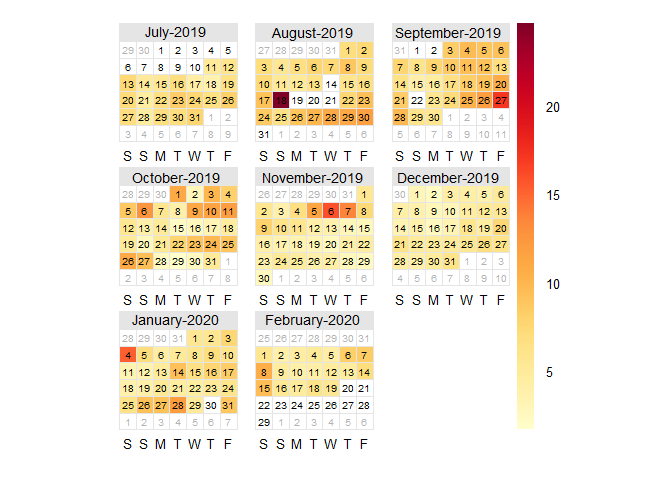
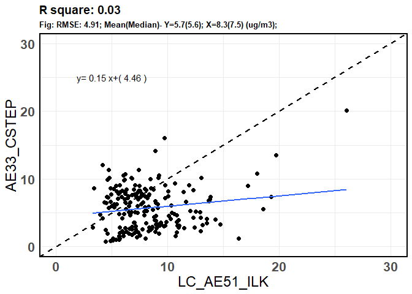

## Black Carbon Ambient Measurements at CSTEP and ILK Labs
The instruments used were: 
- at CSTEP : AE33 
- at ILK Labs : AE51 


## Correlation plot


```r
t<- Correlation(BC$mean_AE33_cstep, BC$mean_BC_mm, BC, lm, 5, 25, 30, "LC_AE51_ILK", "AE33_CSTEP")
t
```

<!-- -->

## t-test


```r
t.test(BC$mean_BC_mm,BC$mean_AE33_cstep )
```

```
## 
## 	Welch Two Sample t-test
## 
## data:  BC$mean_BC_mm and BC$mean_AE33_cstep
## t = 8.054, df = 393.03, p-value = 9.668e-15
## alternative hypothesis: true difference in means is not equal to 0
## 95 percent confidence interval:
##  1.969864 3.242146
## sample estimates:
## mean of x mean of y 
##  8.324371  5.718366
```


```r
names(BC)<-c("hour", "LC_AE51_ILK", "AE33_CSTEP")
BC_melt<-reshape2::melt(BC, id="hour", measure.vars = c( "LC_AE51_ILK",  "AE33_CSTEP") )
names(BC_melt)<-c("hour","Instrument", "BC")
p1<-ggplot(BC_melt, aes(Instrument, BC))+ 
  labs(x="", y= expression(paste("BC" ," (", mu, "g",~m^{-3}, ")")),title=paste0(""))+
  stat_summary(fun.data = f, geom="boxplot", width=0.2, size=1.2)+  
  stat_summary(fun.y=mean, colour="black", geom="point",size=4)+
  scale_y_continuous(limits = c(0,15), expand = c(0, 0))+theme_minimal()+
  theme(legend.text=element_text(size=14),plot.subtitle = element_text(size = 10, face = "bold"),
        plot.title = element_text(size = 12, face = "bold"), 
        axis.title = element_text(size=28, face="bold"),axis.text = element_text(size = 28, colour = "black",face = "bold"),
        panel.border = element_rect(colour = "black", fill=NA, size=1.2),axis.text.x = element_blank() ) + annotate("text", label = "LC_AE51_ILK", x ="LC_AE51_ILK", y =14, size=6, face="bold")+ annotate("text", label = "AE33_CSTEP", x ="AE33_CSTEP", y =14, size=6, face="bold")
p1
```

<!-- -->


