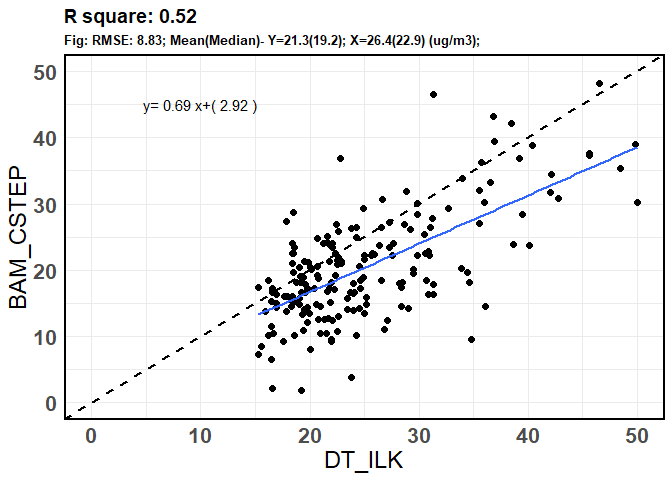
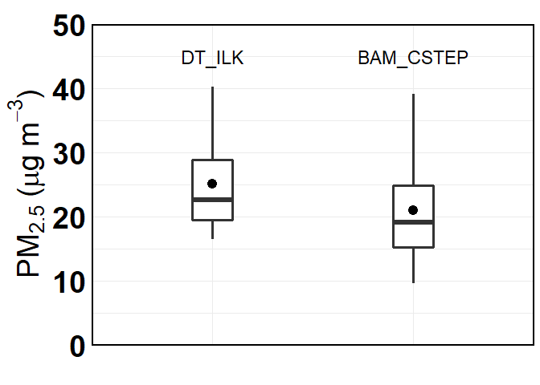
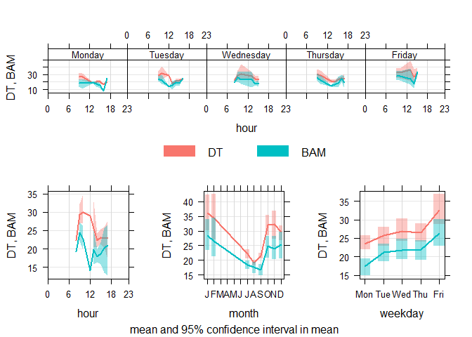
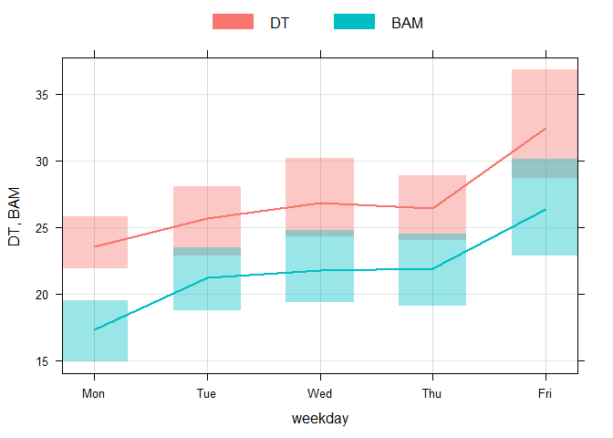

PM2.5 Ambient
================
Adithi
5/30/2020

<style type="text/css">

body, td {
   font-size: 16px;
}
code.r{
  font-size: 16px;
}
pre {
  font-size: 16px
}
</style>

## PM<sub>2.5</sub> Ambient Measurements at CSTEP and ILK Labs

The instruments used were:

  - at ILK Labs : DustTrak 8530 (30 mins before and after the ride)

  - at CSTEP : BAM 1022 (24 hours)

## Days of measurement- Start Date

  - DustTrak: 14 May 2019

*Average of ambient hour.*

``` r
names(data_final_PM1)<-c("date", "DT_ILK")
calendarPlot(data_final_PM1, pollutant = "DT_ILK")
```

<!-- -->

  - BAM: 2 July 2019

*24 hour average*

``` r
names(Final1)<-c("date", "BAM_CSTEP")
calendarPlot(Final1, pollutant = "BAM_CSTEP")
```

<!-- -->

## Correction of DustTrak 8530 using this equation- y=0.21x+11.1

|  |
| :----------------------------------------------------: |
|               *BAM Correction equation*                |

## Correlation plot

From here on, the data for both BAM 1022 and DustTrak 8530 were filtered
where both the data were present ie: starting from 02 July 2019 to 06
February 2020. The hours of DustTrak 8530 were matched with
corresponding hours of BAM 1022

  - DT\_ILK: BAM corrected DustTrak 8530 measurements of
    PM<sub>2.5</sub> placed at ILK Labs for everyday 30 mins before and
    after the rides.

  - BAM\_CSTEP: BAM 1022 measurements of PM<sub>2.5</sub> placed at
    CSTEP

<!-- end list -->

``` r
names(PM)<-c("date", "DT_ILK",  "BAM_CSTEP")
PM$DT_ILK<-(PM$DT_ILK*0.21)+11.1
t<- Correlation(PM$BAM_CSTEP, PM$DT_ILK, PM, lm, 10, 45, 50, "DT_ILK", "BAM_CSTEP")
t
```

<!-- -->

## Time series

``` r
extrafont::loadfonts(device = "win")
theme_set(theme_light(base_size = 15, base_family = "Poppins"))

names(PM)<-c("date", "DT_ILK",  "BAM_CSTEP")
PM$date<- as.POSIXct(PM$date, format='%Y-%m-%d %H:%M:%S', tz="Asia/Kolkata")
PM_melt<-reshape2::melt(PM, id="date", measure.vars = c( "DT_ILK",  "BAM_CSTEP") )
names(PM_melt)<-c("date","Instrument", "PM")
p1<-ggplot(PM_melt, aes(date, PM, color=Instrument))+
  labs(x="",  y= expression(paste(PM[2.5] ," (", mu, "g",~m^{-3}, ")")),title=paste0(""))+ scale_y_continuous(limits = c(0,75), expand = c(0, 0))+scale_x_datetime(date_breaks = "1 month", date_labels = "%b %y")+scale_color_uchicago() +
  theme(axis.title = element_text(size = 16, face = "bold"),
        axis.text.x = element_text(family = "Roboto Mono", size = 14, angle = 90), panel.border = element_rect(colour = "black", fill="NA", size=1.2))+ 
  geom_hline(aes(yintercept = 60), color = "red", size = 1)+geom_line(size=1.2)+annotate("text", x = as.POSIXct("2019-07-30 21:00:00"), y = 65, family = "Poppins", size = 5, color = "red",label = "National Standard")
p1
```

<!-- -->

## t-test

The t-test resulted in p value = 0, mean of DT\_ILK = 26.39, and mean of
BAM\_CSTEP = 21.25.

## Box Plot

``` r
names(PM)<-c("hour", "DT_ILK",  "BAM_CSTEP")
PM_melt<-reshape2::melt(PM, id="hour", measure.vars = c( "DT_ILK",  "BAM_CSTEP") )
names(PM_melt)<-c("hour","Instrument", "PM")
p1<-ggplot(PM_melt, aes(Instrument, PM))+ 
  labs(x="",  y= expression(paste(PM[2.5] ," (", mu, "g",~m^{-3}, ")")),title=paste0(""))+
  stat_summary(fun.data = f, geom="boxplot", width=0.2, size=1.2)+  
  stat_summary(fun.y=mean, colour="black", geom="point",size=4)+
  scale_y_continuous(limits = c(0,50), expand = c(0, 0))+theme_minimal()+
  theme(legend.text=element_text(size=14),plot.subtitle = element_text(size = 10, face = "bold"),
        plot.title = element_text(size = 12, face = "bold"), 
        axis.title = element_text(size=28, face="bold"),axis.text = element_text(size = 28, colour = "black",face = "bold"),
        panel.border = element_rect(colour = "black", fill=NA, size=1.2),axis.text.x = element_blank() ) + annotate("text", label = "DT_ILK", x ="DT_ILK", y =45, size=6, face="bold")+ annotate("text", label = "BAM_CSTEP", x ="BAM_CSTEP", y =45, size=6, face="bold")
p1
```

<!-- -->

## Time Variations

  - DT: BAM Corrected DstTrak 8530 measurements of PM<sub>2.5</sub>

  - BAM: BAM 1022 measurements of PM<sub>2.5</sub>

<!-- end list -->

1.  For the weekday and hours

<!-- end list -->

``` r
names(PM)<-c("date", "DT",  "BAM")
PM_timeVari<-timeVariation(PM, pollutant=c("DT",  "BAM"))
```

<!-- -->

``` r
plot(PM_timeVari, subset = "day.hour") 
```

<!-- -->

2.  For the diurnal plot

<!-- end list -->

``` r
plot(PM_timeVari, subset="hour") 
```

<!-- -->

3.  For the weekday plot

<!-- end list -->

``` r
plot(PM_timeVari, subset="day") 
```

<!-- -->

4.  For the monthly plot

<!-- end list -->

``` r
plot(PM_timeVari, subset="month") 
```

<!-- -->
