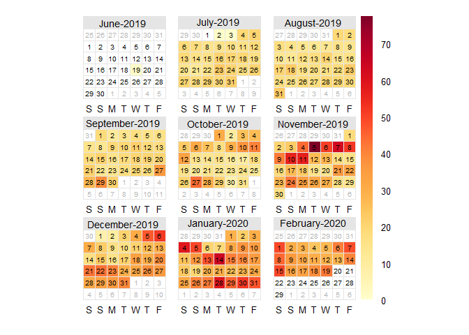

PM 2.5 Ambient
================
Adithi
5/30/2020

## PM 2.5 Ambient Measurements at CSTEP and ILK Labs

The instruments used were: - at CSTEP : BAM 1022 - at ILK Labs :
DustTrak 8530

## Days of measurement

  - BAM: 2 July 2019

<!-- end list -->

``` r
names(Final1)<-c("date", "BAM_CSTEP")
calendarPlot(Final1, pollutant = "BAM_CSTEP")
```

<!-- -->

  - DustTrak: 14 May 2019

<!-- end list -->

``` r
names(data_final_PM1)<-c("date", "DT_ILK")
calendarPlot(data_final_PM1, pollutant = "DT_ILK")
```

<!-- -->

## Correlation plot

``` r
t<- Correlation(PM$BAM_CSTEP, PM$DT_ILK, PM, lm, 50, 275, 300, "DT_ILK", "BAM_CSTEP")
t
```

<!-- -->

## t-test

``` r
t.test(PM$DT_ILK,PM$BAM_CSTEP )
```

    ## 
    ##  Welch Two Sample t-test
    ## 
    ## data:  PM$DT_ILK and PM$BAM_CSTEP
    ## t = 15.126, df = 209.86, p-value < 2.2e-16
    ## alternative hypothesis: true difference in means is not equal to 0
    ## 95 percent confidence interval:
    ##  44.84964 58.29209
    ## sample estimates:
    ## mean of x mean of y 
    ##  72.82368  21.25282

## Box Plot

  - DT\_ILK: DustTrak 8530 measurements of PM2.5 placed at ILK Labs for
    everyday 30 mins before and after the rides.

  - BAM\_CSTEP: BAM 1022 measurements of PM2.5 placed at CSTEP

<!-- end list -->

``` r
names(PM)<-c("hour", "DT_ILK",  "BAM_CSTEP")
PM_melt<-reshape2::melt(PM, id="hour", measure.vars = c( "DT_ILK",  "BAM_CSTEP") )
names(PM_melt)<-c("hour","Instrument", "PM")
p1<-ggplot(PM_melt, aes(Instrument, PM))+ 
  labs(x="",  y= expression(paste(PM[2.5] ," (", mu, "g",~m^{-3}, ")")),title=paste0(""))+
  stat_summary(fun.data = f, geom="boxplot", width=0.2, size=1.2)+  
  stat_summary(fun.y=mean, colour="black", geom="point",size=4)+
  scale_y_continuous(limits = c(0,200), expand = c(0, 0))+theme_minimal()+
  theme(legend.text=element_text(size=14),plot.subtitle = element_text(size = 10, face = "bold"),
        plot.title = element_text(size = 12, face = "bold"), 
        axis.title = element_text(size=28, face="bold"),axis.text = element_text(size = 28, colour = "black",face = "bold"),
        panel.border = element_rect(colour = "black", fill=NA, size=1.2),axis.text.x = element_blank() ) + annotate("text", label = "DT_ILK", x ="DT_ILK", y =180, size=6, face="bold")+ annotate("text", label = "BAM_CSTEP", x ="BAM_CSTEP", y =180, size=6, face="bold")
p1
```

<!-- -->

## Time Variations

``` r
names(PM)<-c("date", "DT",  "BAM")
timeVariation(PM, pollutant=c("DT",  "BAM"))
```

<!-- -->
