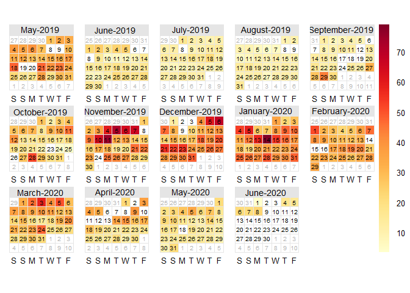
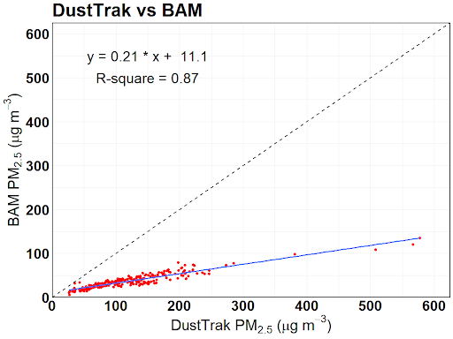
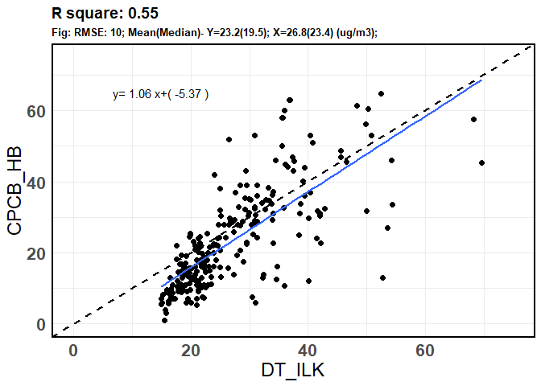
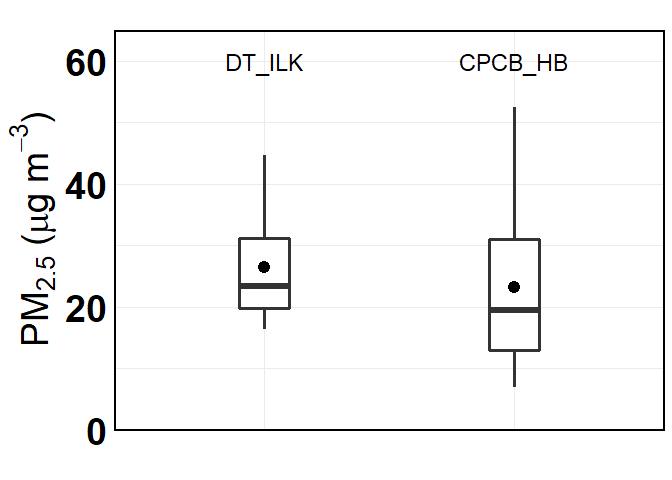
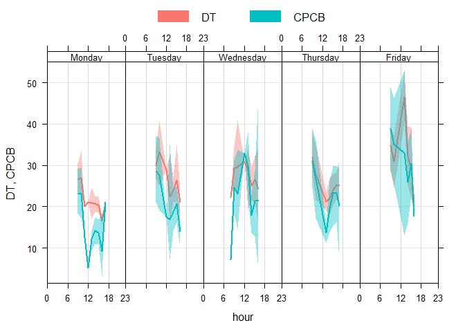
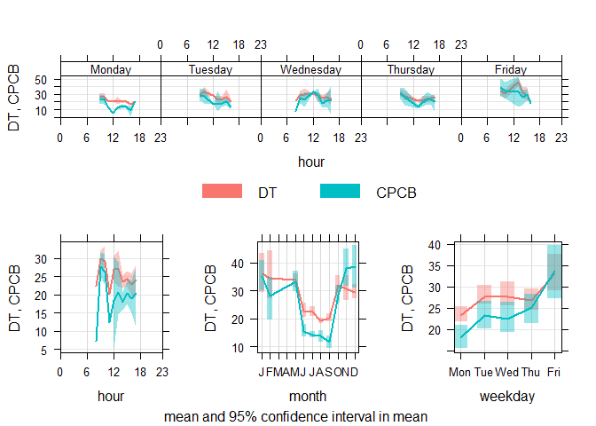
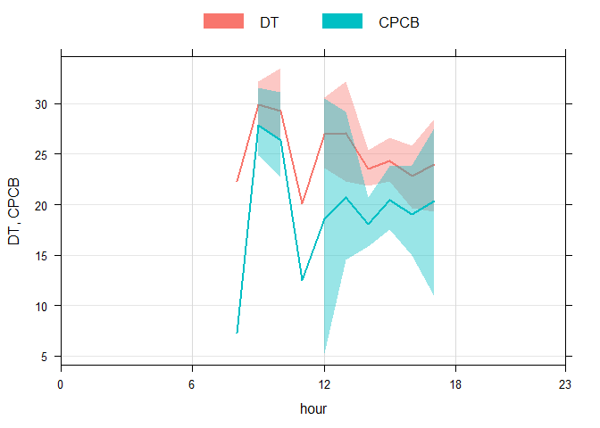
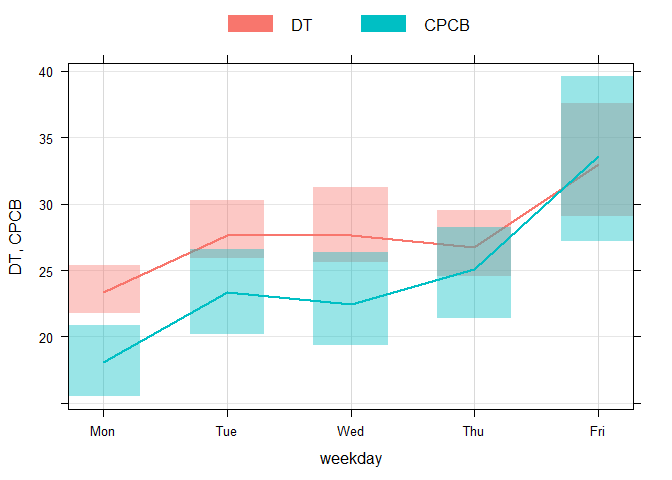

DustTrak and CPCB Analysis
================
Adithi
6/10/2020

## PM<sub>2.5</sub> Ambient Measurements at CPCB and ILK Labs

The instruments used were:

  - at ILK Labs : DustTrak 8530 (30 mins before and after the ride)

  - at CPCB Hebbal (HB): BAM 1022 (24 hours)

## Days of measurement- Start Date

  - DustTrak: 14 May 2019

*Average of ambient hour.*

``` r
names(data_final_PM1)<-c("date", "DT_ILK")
calendarPlot(data_final_PM1, pollutant = "DT_ILK")
```

<!-- -->

  - CPCB Hebbal: 01 May 2019

*24 hour average*

``` r
names(CPCB_hebbal)<-c("date", "CPCB_HB")
calendarPlot(CPCB_hebbal, pollutant = "CPCB_HB")
```

<!-- -->

## Correction of DustTrak 8530 using this equation- y=0.21x+11.1

| |
|:–:|  
*BAM Correction equation* |

## Correlation plot

From here on, the data for both BAM 1022 and DustTrak 8530 were filtered
where both the data were present ie: starting from 02 July 2019 to 06
February 2020. The hours of DustTrak 8530 were matched with
corresponding hours of BAM 1022

  - DT\_ILK: BAM corrected DustTrak 8530 measurements of
    PM<sub>2.5</sub> placed at ILK Labs for everyday 30 mins before and
    after the rides.

  - CPCB\_HB: BAM 1022 measurements of PM<sub>2.5</sub> placed at the
    Hebbal CPCB station.

<!-- end list -->

``` r
names(PM)<-c("date", "DT_ILK",  "CPCB_HB")
PM$DT_ILK<-(PM$DT_ILK*0.21)+11.1
t<- Correlation(PM$CPCB_HB, PM$DT_ILK, PM, lm, 15, 65, 75, "DT_ILK", "CPCB_HB")
t
```

<!-- -->

## t-test

``` r
t.test(PM$DT_ILK,PM$CPCB_HB )
```

    ## 
    ##  Welch Two Sample t-test
    ## 
    ## data:  PM$DT_ILK and PM$CPCB_HB
    ## t = 3.4119, df = 445.46, p-value = 0.0007041
    ## alternative hypothesis: true difference in means is not equal to 0
    ## 95 percent confidence interval:
    ##  1.553401 5.774318
    ## sample estimates:
    ## mean of x mean of y 
    ##  26.84086  23.17700

## Box Plot

``` r
names(PM)<-c("hour", "DT_ILK",  "CPCB_HB")
PM_melt<-reshape2::melt(PM, id="hour", measure.vars = c( "DT_ILK",  "CPCB_HB") )
names(PM_melt)<-c("hour","Instrument", "PM")
p1<-ggplot(PM_melt, aes(Instrument, PM))+ 
  labs(x="",  y= expression(paste(PM[2.5] ," (", mu, "g",~m^{-3}, ")")),title=paste0(""))+
  stat_summary(fun.data = f, geom="boxplot", width=0.2, size=1.2)+  
  stat_summary(fun.y=mean, colour="black", geom="point",size=4)+
  scale_y_continuous(limits = c(0,65), expand = c(0, 0))+theme_minimal()+
  theme(legend.text=element_text(size=14),plot.subtitle = element_text(size = 10, face = "bold"),
        plot.title = element_text(size = 12, face = "bold"), 
        axis.title = element_text(size=28, face="bold"),axis.text = element_text(size = 28, colour = "black",face = "bold"),
        panel.border = element_rect(colour = "black", fill=NA, size=1.2),axis.text.x = element_blank() ) + annotate("text", label = "DT_ILK", x ="DT_ILK", y =60, size=6, face="bold")+ annotate("text", label = "CPCB_HB", x ="CPCB_HB", y =60, size=6, face="bold")
p1
```

<!-- -->

## Time Variations

  - DT: BAM Corrected DstTrak 8530 measurements of PM<sub>2.5</sub>

  - CPCB: BAM 1022 measurements of PM<sub>2.5</sub> placed at the Hebbal
    CPCB station.

<!-- end list -->

1.  For the weekday and hours

<!-- end list -->

``` r
names(PM)<-c("date", "DT",  "CPCB")
PM_timeVari<-timeVariation(PM, pollutant=c("DT",  "CPCB"))
```

<!-- -->

``` r
plot(PM_timeVari, subset = "day.hour") 
```

<!-- -->

2.  For the diurnal plot

<!-- end list -->

``` r
plot(PM_timeVari, subset="hour") 
```

<!-- -->

3.  For the weekday plot

<!-- end list -->

``` r
plot(PM_timeVari, subset="day") 
```

<!-- -->

4.  For the monthly plot

<!-- end list -->

``` r
plot(PM_timeVari, subset="month") 
```

<!-- -->
